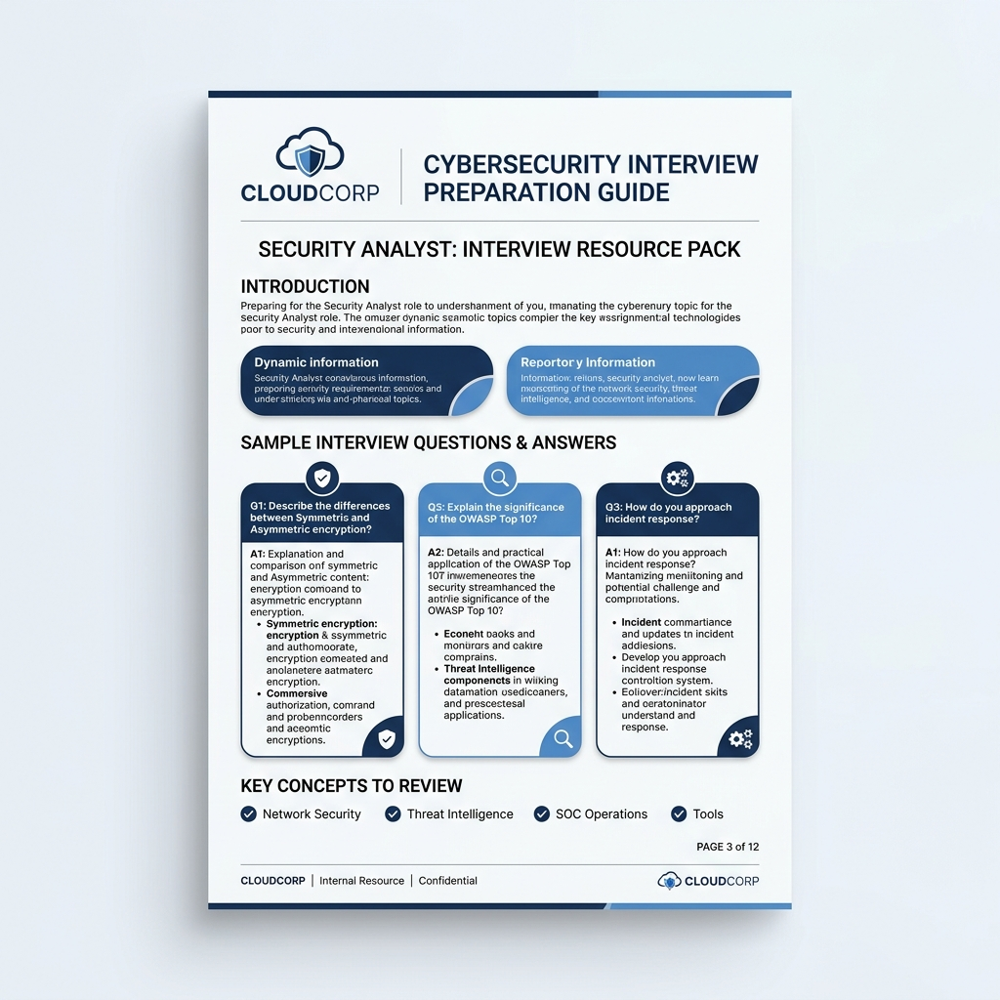

# Tailored Interview Preparation Guide Generator

An automated command-line utility designed to source recent real-world interview questions and synthesize highly customized preparation guides in premium PDF format. It aligns the candidate's actual professional resume and background history (RUC) with the specific requirements of target companies and roles.

---

## ⚠️ Privacy Warning
> **IMPORTANT PRIVACY NOTE:** This tool processes sensitive personal resume and career information.
> - For completely private/offline execution, run the tool using `--provider local`.
> - If utilizing `--provider gemini`, your resume and background document contents will be uploaded to the Google Gemini cloud API for analysis and synthesis.
> - **DO NOT** commit your personal resume files, RUC documents, `.env` files, or generated PDFs to public version control repositories (e.g. GitHub). Strict defaults have been configured in `.gitignore` to prevent accidental leaks.

---

## Architecture Overview
The repository is split into clean, single-responsibility modules to make it portfolio-ready, easily testable, and maintainable:
- **`interview_prep_generator.py`**: The CLI entry point, argument parser, and orchestrator.
- **`doc_loader.py`**: Document parser for extracting text from Word `.docx` documents.
- **`ai_provider.py`**: Connects to the Gemini cloud client and local OpenAI-compatible API servers (Ollama/Odysseus). Implements structured JSON output formatting and validation retry loops.
- **`pdf_generator.py`**: Styles and builds premium PDFs using the ReportLab layout engine.
- **`utils.py`**: Collection of sanitization, standard HTML escaping, and JSON cleaning helpers.

---

## Features
- **Structured JSON Output**: Uses structured JSON communication with LLMs, validating schema compliance and auto-retrying malformed responses once with a correction prompt.
- **Google Search Grounded Sourcing**: Leverages live Google Search grounding via Gemini to discover recent, company-specific interview questions.
- **Local-First / Private Mode**: Full support for running models locally (e.g., Llama 3, Mistral) via **Ollama** or PewDiePie's **Odysseus** workspace endpoint.
- **Automatic Fallback**: Gracefully falls back from Gemini cloud to local LLM engines if rate limits (HTTP 429) are encountered.
- **ReportLab HTML Escaping**: Uses standard `html.escape` to dynamically format and render STAR narrative blocks cleanly without crashes.
- **Demo Mode**: Built-in mock data mode allowing immediate, credential-free evaluation.

---

## Setup & Installation

1. **Clone the repository**:
   ```bash
   git clone https://github.com/ruudeAI/Interview-prep-Initial.git
   cd Interview-prep-Initial
   ```

2. **Install Python dependencies**:
   ```bash
   pip install -r requirements.txt
   ```

3. **Configure Environment Variables**:
   Copy the environment template file:
   ```bash
   cp .env.example .env
   ```
   Edit `.env` and supply your `GEMINI_API_KEY` (if using cloud features).

4. **Add Personal Resumes**:
   Place your resume (`resume.docx`) and background details (`ruc.docx`) in the project root folder. These paths can also be customized via CLI arguments.

---

## Usage Examples

### 1. Demo Mode (Safe for public demo/recruiter testing)
Generate a sample prep guide instantly using mock candidate profiles and dummy company details:
```bash
python interview_prep_generator.py --demo
```

### 2. Cloud Mode (Gemini API)
Source company-specific questions via Google Search grounding and generate guides using Gemini:
```bash
python interview_prep_generator.py --companies "PNC, Google" --role "Security Analyst" --resume "my_resume.docx" --candidate-name "Jane Doe" --provider gemini
```
*(You will be asked to confirm your consent to transmit documents to the cloud unless `--yes` is specified).*

### 3. Local-Only Mode (Ollama/Odysseus)
Generate guides completely offline using local models:
```bash
python interview_prep_generator.py --provider local --local-model "llama3" --companies "TargetCorp" --resume "my_resume.docx"
```

---

## Demo Output Preview
Below is a preview of the premium PDF document page layout generated in demo mode:



---

## Troubleshooting & Security Notes

- **Ollama Connection Refused (`[WinError 10061]`)**: Ensure your local Ollama server is running. You can check it by opening `http://localhost:11434` in your browser.
- **Gemini Rate Limit (429)**: The tool will automatically wait and back off or fall back to your local endpoint if you pass both providers.
- **Port Binding**: Do not expose local LLM endpoints to the public internet. Keep Ollama bound to `127.0.0.1`.

## Future Improvements
- Add automated web scraping fallbacks using Apify Glassdoor Scraper.
- Support additional input resume formats (PDF, Markdown, raw text).
- Add web dashboard or GUI using Streamlit or Tailwind CSS.
